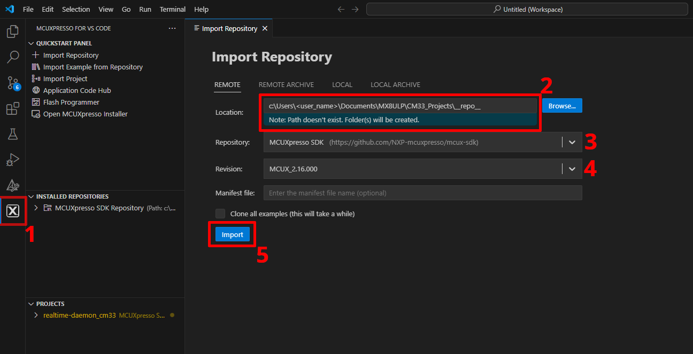
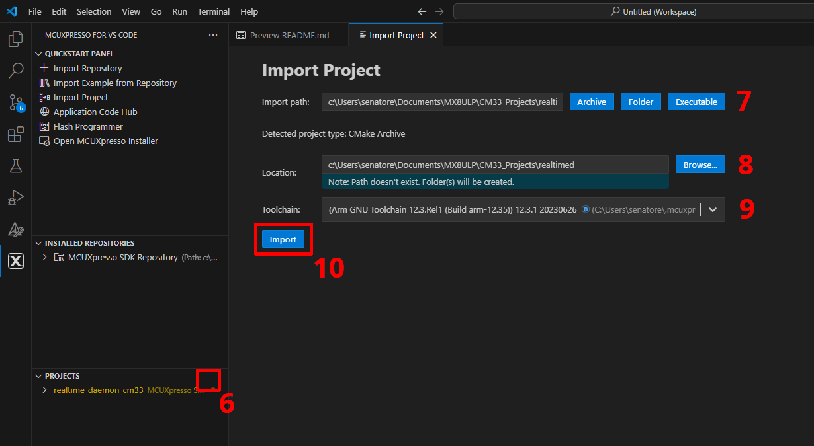

# F+S Realtime Daemon

The F+S Realtime Daemon is a FreeRTOS application that provides SRTM services and board support code for fsimx8ulp boards. The SRTM services provide additional interfaces that can be used in Linux.

The following services are currently supported for Linux
- IO including GPIO IRQ handling
- I2C/I3C as master
- LifeCycle service

TODOs:
- PWM services
- LPAudio services
- UART services

## Import Project with MCUXpresso for VS Code

> [!NOTE]  
> MCUXpresso IDE is not supported

Download and Install the `MCUXpresso for VS Code` extansion for Code

Open MCUXpresso Installer, select `MCUXpresso SDK Developer`, `Arm GNU Toolchain`, `Standalone Toochain Add-ons`, `CMSIS Toolbox` and click install.

Follow the Instruction in the Images:

  

1. Open the Extension in Code. Next to `INSTALLED REPOSITORIES`, Click on `+`
2.  Chose a Location for the Repo directory
> [!NOTE]  
> The Directory must be called `__repo__`
3. Select MCUXpresso SDK
4. Select MCUX Revision
5. Click on Import

  

6. Click on `Import Project` next to `PROJECTS`
7. Define the Import path for this project
> [!NOTE]  
> The Import Path must be next to `__repo__` dir
8. Define Location
9. Select a Toolchain
10. Click on Import

## Build with MCUXpresso for VS Code

Open MCUXpresso for VS Code and click on `Build Selected` in `PROJECTS` tab.
